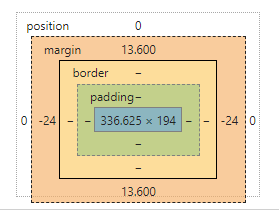

当前环境中，直接手写 css 的越来越少，主要是通过各种预编译器来做，主要原因会通过如下几点进行描述。

先看一下 css 的一些基础点，这里只说关键的，完整的可以自己查看 [css2.1规范](http://www.ayqy.net/doc/css2-1/cover.html) 。

## css 基础知识点 ##

### css 盒模型 ###




页面都是通过盒模型来拼凑的，首先需要知道都有哪些块模型（也就是 display 的值）：

1. inline: 行内元素
2. inline-block: 行内块元素
3. block: 块元素
4. none: 不显示元素，不占位置
5. table 及其相关: 主要用于设置以表格的形式展示内容
6. flex 及其相关: 弹性布局
7. grid 及其相关: 网格布局

一般最常用的 div 就 `display: block` 的通用块。

### css 变量 ###

定义语法 `--*` ，使用语法 `var(--*)`

`*` 表示变量名称，可以是 数字字母下划线短横线 `[0-9a-zA-Z_-]` 进行组合。

无论变量定义还是使用都只能在声明块 `{}` 内：

```css
/* 全局变量 */
:root {
  --theme: #f00;
}
/* 局部变量 */
.side {
  --color: #0f0;
}

.content {
  color: var(--theme);
}
.footer {
  color: var(--color);
}
```

```html
<div class="content">
  <div class="body"></div>
  <div class="side"></div>
  <div class="footer"></div>
</div>
```

javascript 可以获取和设置 css 中的变量：

```javascript
// 获取 css 变量值
getComputedStyle(document.documentElement).getPropertyValue('--color')

// 设置 css 变量值
document.documentElement.style.setProperty('--color', '#' + Math.random().toString(16).slice(2,8))
```

例子： 

```html
<!DOCTYPE html>
<html lang="zh-CN">
<head>
  <meta charset="UTF-8">
  <meta name="viewport" content="width=device-width, initial-scale=1.0">
  <meta http-equiv="X-UA-Compatible" content="ie=edge">
  <title>css变量</title>
  <style>
    :root {
      --color: #f00;
    }
    html,
    body {
      margin: 0;
      height: 100%;
    }
    body {
      display: flex;
      flex-direction: column;
    }
    .header, .footer {
      height: 30px;
      color: var(--color);
    }
    .body {
      --color: #00f;
      flex: auto;
      color: var(--color);
    }
  </style>
</head>
<body>
  <div class="header">headerheaderheader</div>
  <div class="body" id="body">
    <button id="changeTheme">修改主题色</button>
    <button id="changeBodyTheme">修改body主题色</button>
    <div>bodybodybody</div>
  </div>
  <div class="footer">footerfooterfooter</div>
  <script>
    document.querySelector("#changeTheme").onclick = function(){
      console.log(getComputedStyle(document.documentElement).getPropertyValue('--color').trim())
      document.documentElement.style.setProperty('--color', '#' + Math.random().toString(16).slice(2,8))
    }
    document.querySelector("#changeBodyTheme").onclick = function(){
      console.log(getComputedStyle(document.querySelector("#body")).getPropertyValue('--color').trim())
      document.querySelector("#body").style.setProperty('--color', '#' + Math.random().toString(16).slice(2,8))
    }
  </script>
</body>
</html>
```

## Less ##

参考链接：[Less文档](https://less.bootcss.com/)

### Less 变量 ###

```less
@width: 10px;
@height: @width + 10px;

#header {
  width: @width;
  height: @height;
}
```

编译后：

```css
#header {
  width: 10px;
  height: 20px;
}
```

Less 变量还可以用与以下几种情况：

1. 选择器

    ```less
    @my-selector: banner;

    .@{my-selector} {
      font-weight: bold;
      line-height: 40px;
      margin: 0 auto;
    }
    ```

    编译后：

    ```css
    .banner {
      font-weight: bold;
      line-height: 40px;
      margin: 0 auto;
    }
    ```

2. URLs

    ```less
    @images: "../img";

    body {
      color: #444;
      background: url("@{images}/white-sand.png");
    }
    ```

3. Import Statements

    ```less
    @themes: "../../src/themes";

    @import "@{themes}/tidal-wave.less";
    ```

4. Properties

    ```less
    @property: color;

    .widget {
      @{property}: #0ee;
      background-@{property}: #999;
    }
    ```

    编译后：

    ```css
    .widget {
      color: #0ee;
      background-color: #999;
    }
    ```

5. Variable Variables

    ```less
    @primary:  green;
    @secondary: blue;

    .section {
      @color: primary;

      .element {
        color: @@color;
      }
    }
    ```

    编译后：

    ```css
    .section .element {
      color: green;
    }
    ```

### Less 混合 ###

#### Less 混合 简单使用 ####

```less
.bordered {
  border-top: dotted 1px black;
  border-bottom: solid 2px black;
}

#menu a {
  color: #111;
  .bordered();
}

.post a {
  color: red;
  .bordered();
}
```

编译后：

```css
#menu a {
  color: #111;
  border-top: dotted 1px black;
  border-bottom: solid 2px black;
}

.post a {
  color: red;
  border-top: dotted 1px black;
  border-bottom: solid 2px black;
}
```

#### Less 混合 带参数混合 ####

```less
.border-radius(@radius) {
  -webkit-border-radius: @radius;
     -moz-border-radius: @radius;
          border-radius: @radius;
}

.button {
  .border-radius(6px);
}
```

#### Less 混合 参数默认值混合 ####

```less
.border-radius(@radius: 5px) {
  -webkit-border-radius: @radius;
     -moz-border-radius: @radius;
          border-radius: @radius;
}

.button {
  .border-radius();
}
#header {
  .border-radius(4px);
}
```

### Less 嵌套 ###

```less
#header {
  color: black;
  .navigation {
    font-size: 12px;
  }
  .logo {
    width: 300px;
  }
}
```

编译后：

```css
#header {
  color: black;
}
#header .navigation {
  font-size: 12px;
}
#header .logo {
  width: 300px;
}
```

注意：请勿过多的嵌套层。

在嵌套内可以使用 `&` 来指向父选择器

```less
a {
  color: blue;
  &:hover {
    color: green;
  }
}
```

编译后：

```css
a {
  color: blue;
}

a:hover {
  color: green;
}
```

### Less 导入 ###

```less
@import "library.less";
```

## Sass ##

参考链接：[Sass文档](https://www.sasscss.com/)

### Sass 变量 ###

```scss
$nav-color: #F90;
nav {
  $width: 100px;
  width: $width;
  color: $nav-color;
}
```

编译后：

```css
nav {
  width: 100px;
  color: #F90;
}
```

默认变量值 `!default` ，如果这个变量被声明赋值了，那就用它声明的值，否则就用这个默认值。

```scss
$fancybox-width: 400px !default;

.fancybox {
  width: $fancybox-width;
}
```

在上例中，如果成员在导入你的 `sass` 局部文件之前声明了一个 `$fancybox-width` 变量，那么你的局部文件中对 `$fancybox-width` 赋值 `400px` 的操作就无效。如果成员没有做这样的声明，则 `$fancybox-width` 将默认为 `400px`。

Element-ui 的 [`var.scss`](https://github.com/ElemeFE/element/blob/dev/packages/theme-chalk/src/common/var.scss) 文件中就使用的默认变量值。

Sass 变量值可以借助插值 `#{}` 可以应用到如下模式：

1. 选择器

    ```scss
    $name: foo;
    $attr: border;
    p.#{$name} {
      #{$attr}-color: blue;
    }
    ```

    编译后：

    ```css
    p.foo {
      border-color: blue;
    }
    ```

2. 属性值，不过通常直接使用变量更方便

    ```scss
    p {
      $font-size: 12px;
      $line-height: 30px;
      font: #{$font-size}/#{$line-height};
    }
    ```

    编译后：

    ```css
    p {
      font: 12px/30px;
    }
    ```

### Sass 混合 ###

#### Sass 混合 简单使用 ####

混合器使用 `@mixin` 标识符定义。

```scss
@mixin rounded-corners {
  -moz-border-radius: 5px;
  -webkit-border-radius: 5px;
  border-radius: 5px;
}
```

通过 `@include` 使用混合器。

```scss
.notice {
  background-color: green;
  border: 2px solid #00aa00;
  @include rounded-corners;
}

//sass最终生成：
.notice {
  background-color: green;
  border: 2px solid #00aa00;
  -moz-border-radius: 5px;
  -webkit-border-radius: 5px;
  border-radius: 5px;
}
```

#### Sass 混合器中的CSS规则 ####

```scss
@mixin no-bullets {
  list-style: none;
  li {
    list-style-image: none;
    list-style-type: none;
    margin-left: 0px;
  }
}

ul.plain {
  color: #444;
  @include no-bullets;
}
```

编译后：

```css
ul.plain {
  color: #444;
  list-style: none;
}
ul.plain li {
  list-style-image: none;
  list-style-type: none;
  margin-left: 0px;
}
```

#### Sass 混合器传参 ####

```scss
@mixin link-colors($normal, $hover, $visited) {
  color: $normal;
  &:hover { color: $hover; }
  &:visited { color: $visited; }
}

a {
  @include link-colors(blue, red, green);
}
```

编译后：

```css
a { color: blue; }
a:hover { color: red; }
a:visited { color: green; }
```

传参的时候还可以通过 `key:value` ，这种方式不必在意参数顺序：

```scss
a {
  @include link-colors(
    $normal: blue,
    $visited: green,
    $hover: red
  );
}
```

#### Sass 默认参数值 ####

```scss
@mixin link-colors(
    $normal,
    $hover: $normal,
    $visited: $normal
  )
{
  color: $normal;
  &:hover { color: $hover; }
  &:visited { color: $visited; }
}

a {
  @include link-colors(blue); // 相当于 @include link-colors(blue, blue, blue)
}
```

### Sass 嵌套 ###

```scss
#content {
  article {
    h1 { color: #333 }
    p { margin-bottom: 1.4em }
  }
  aside { background-color: #EEE }
}
```

编译后：

```css
#content article h1 { color: #333 }
#content article p { margin-bottom: 1.4em }
#content aside { background-color: #EEE }
```

注意：请勿过多的嵌套层。

#### 父选择器的标识符 `&` ####

```scss
article a {
  color: blue;
  &:hover { color: red }
}
```

编译后：

```css
article a { color: blue }
article a:hover { color: red }
```

### Sass 导入 ###

```scss
@import "library.scss";
```

#### Sass 部分文件 ####

定义：当通过 `@import` 把 `sass` 样式分散到多个文件时，你通常只想生成少数几个 `css` 文件。那些专门为 `@import` 命令而编写的 `sass` 文件，并不需要生成对应的独立 `css` 文件，这样的 `sass` 文件称为局部文件。

`sass` 局部文件的文件名以下划线开头。

使用可以参照 <https://github.com/ElemeFE/element/blob/dev/packages/theme-chalk/src/mixins/_button.scss> 。

#### Sass 嵌套导入 ####

嵌套导入生成对应的 `css` 文件时，局部文件会被直接插入到 `css` 规则内导入它的地方。

例如有一个名为 `_blue-theme.scss` 的局部文件，内容如下：

```scss
aside {
  background: blue;
  color: white;
}
```

```scss
.blue-theme {@import "blue-theme"}
```

生成的结果跟你直接在 `.blue-theme` 选择器内写 `_blue-theme.scss` 文件的内容完全一样。

```scss
.blue-theme {
  aside {
    background: blue;
    color: #fff;
  }
}
```

#### Sass 原生CSS的导入 ####

通常在 `sass` 中使用 `@import` 时，`sass` 会尝试找到对应的 `sass` 文件并导入进来，但在下列三种情况下会生成原生的 `CSS@import`，尽管这会造成浏览器解析 `css` 时的额外下载：

1. 被导入文件的名字以 `.css` 结尾；
2. 被导入文件的名字是一个URL地址（比如 `http://www.sass.hk/css/css.css` ），由此可用谷歌字体API提供的相应服务；
3. 被导入文件的名字是 `CSS` 的url()值。

这就是说，你不能用 `sass` 的 `@import` 直接导入一个原始的 `css` 文件，因为 `sass` 会认为你想用 `css` 原生的 `@import`。但是，因为 `sass` 的语法完全兼容 `css`，所以你可以把原始的 `css` 文件改名为 `.scss` 后缀，即可直接导入了。

### Sass 静默注释 ###

语法：

```scss
// 注释内容直到行末
```

静默注释的内容不会出现在生成的 `css` 文件中。

### Sass 选择器继承 ###

```scss
//通过选择器继承继承样式
.error {
  border: 1px red;
  background-color: #fdd;
}
.seriousError {
  @extend .error;
  border-width: 3px;
}
```

`.seriousError` 将会继承样式表中任何位置处为 `.error` 定义的所有样式。以 `class="seriousError"` 修饰的 `html` 元素最终的展示效果就好像是 `class="seriousError error"`。

`.seriousError` 不仅会继承 `.error` 自身的所有样式，任何跟 `.error` 有关的组合选择器样式也会被 `.seriousError` 以组合选择器的形式继承，如下代码:

```scss
//.seriousError从.error继承样式
.error a{  //应用到.seriousError a
  color: red;
  font-weight: 100;
}
h1.error { //应用到hl.seriousError
  font-size: 1.2rem;
}
```

关于 `@extend` 有两个要点:

1. 跟混合器相比，继承生成的 `css` 代码相对更少。因为继承仅仅是重复选择器，而不会重复属性，所以使用继承往往比混合器生成的 `css` 体积更小。如果你非常关心你站点的速度，请牢记这一点。
2. 继承遵从 `css` 层叠的规则。当两个不同的 `css` 规则应用到同一个 `html` 元素上时，并且这两个不同的 `css` 规则对同一属性的修饰存在不同的值，`css` 层叠规则会决定应用哪个样式。相当直观：通常权重更高的选择器胜出，如果权重相同，定义在后边的规则胜出。

### Sass 函数指令 ###

```scss
$grid-width: 40px;
$gutter-width: 10px;

@function grid-width($n) {
  @return $n * $grid-width + ($n - 1) * $gutter-width;
}

#sidebar { width: grid-width(5); }
```

编译后：

```css
#sidebar {
  width: 240px;
}
```

`@function` 用于定义函数。
`@return` 用于设置函数的返回值。

### 其他指令说明 ###

#### @at-root ####

`@at-root` 指令导致一个或多个规则被限定输出在文档的根层级上，而不是被嵌套在其父选择器下。它可以被用于单一或内联选择器：

```scss
.parent {
  ...
  @at-root .child { ... }
}
```

编译后：

```css
.parent { ... }
.child { ... }
```

#### @if ####

`@if` 指令需要一个 SassScript 表达和嵌套在它下面要使用的样式，如果表达式返回值不为 `false` 或者  `null` ，那么后面花括号中的内容就会返回：

```scss
p {
  @if 1 + 1 == 2 { border: 1px solid; }
  @if 5 < 3      { border: 2px dotted; }
  @if null       { border: 3px double; }
}
```

编译后：

```css
p {
  border: 1px solid;
}
```

`@if` 语句后面可以跟多个 `@else if` 语句和一个 `@else` 语句。

```scss
$type: monster;
p {
  @if $type == ocean {
    color: blue;
  } @else if $type == matador {
    color: red;
  } @else if $type == monster {
    color: green;
  } @else {
    color: black;
  }
}
```

编译后：

```css
p {
  color: green;
}
```

#### @for ####

`@for` 指令重复输出一组样式。对于每次重复，计数器变量用于调整输出结果。该指令有两种形式：`@for $var from <start> through <end>` 和 `@for $var from <start> to <end>`。注意关键字 `through` 和 `to` 的区别。`$var` 可以是任何变量名，比如 `$i` ; `<start>` 和 `<end>` 是应该返回整数的 SassScript 表达式。当 `<start>` 比 `<end>` 大的时候，计数器将递减，而不是增量。

`@for` 语句将设置 `$var` 为指定的范围内每个连续的数值，并且每一次输出的嵌套样式中使用 `$var` 的值。对于 `from ... through` 的形式，范围包括 `<start>` 和 `<end>` 的值，但 `from ... to` 的形式从 `<start>` 开始运行，但不包括 `<end>` 的值。

```scss
@for $i from 1 through 3 {
  .item-#{$i} { width: 2em * $i; }
}

@for $i from 4 to 6 {
  .item-#{$i} { width: 2em * $i; }
}
```

编译后：

```css
.item-1 {
  width: 2em;
}
.item-2 {
  width: 4em;
}
.item-3 {
  width: 6em;
}

.item-4 {
  width: 8em;
}
.item-5 {
  width: 10em;
}
```

快速实现栅栏布局：<https://github.com/jdf2e/nutui/blob/master/src/packages/col/col.scss> 。

#### @each ####

`@each` 指令通常格式是 `@each $var in <list or map>`。`$var` 可以是任何变量名，像 `$length` 或者 `$name`，和`<list or map>`是一个返回列表（list）或 map 的 SassScript 表达式。

`@each` 规则将 `$var` 设置为列表（list）或 map 中的每个项目，输出样式中包含使用 `$var` 的值。

```scss
@each $animal in puma, sea-slug, egret, salamander {
  .#{$animal}-icon {
    background-image: url('/images/#{$animal}.png');
  }
}
```

编译后：

```css
.puma-icon {
  background-image: url('/images/puma.png');
}
.sea-slug-icon {
  background-image: url('/images/sea-slug.png');
}
.egret-icon {
  background-image: url('/images/egret.png');
}
.salamander-icon {
  background-image: url('/images/salamander.png');
}
```

多重赋值:

1. list

    ```scss
    @each $animal, $color, $cursor in (puma, black, default),
                                      (sea-slug, blue, pointer),
                                      (egret, white, move) {
      .#{$animal}-icon {
        background-image: url('/images/#{$animal}.png');
        border: 2px solid $color;
        cursor: $cursor;
      }
    }
    ```

    编译后：

    ```css
    .puma-icon {
      background-image: url('/images/puma.png');
      border: 2px solid black;
      cursor: default;
    }
    .sea-slug-icon {
      background-image: url('/images/sea-slug.png');
      border: 2px solid blue;
      cursor: pointer;
    }
    .egret-icon {
      background-image: url('/images/egret.png');
      border: 2px solid white;
      cursor: move;
    }
    ```

2. maps

    ```scss
    @each $header, $size in (h1: 2em, h2: 1.5em, h3: 1.2em) {
      #{$header} {
        font-size: $size;
      }
    }
    ```

    编译后：

    ```css
    h1 {
      font-size: 2em;
    }
    h2 {
      font-size: 1.5em;
    }
    h3 {
      font-size: 1.2em;
    }
    ```

#### @while ####

`@while` 指令重复输出嵌套样式，直到SassScript表达式返回结果为 `false` 。这可用于实现比 `@for` 语句更复杂的循环。

```scss
$i: 6;
@while $i > 0 {
  .item-#{$i} {
    width: 2em * $i;
  }
  $i: $i - 2;
}
```

编译后：

```css
.item-6 {
  width: 12em;
}

.item-4 {
  width: 8em;
}

.item-2 {
  width: 4em;
}
```

### Sass 举例 ###

```scss
// 清楚浮动
@mixin utils-clearfix {
  $selector: &;

  @at-root {
    #{$selector}::before,
    #{$selector}::after {
      display: table;
      content: "";
    }
    #{$selector}::after {
      clear: both
    }
  }
}
// 垂直居中
@mixin utils-vertical-center {
  $selector: &;

  @at-root {
    #{$selector}::after {
      display: inline-block;
      content: "";
      height: 100%;
      vertical-align: middle
    }
  }
}
// 超过...
@mixin utils-ellipsis {
  overflow: hidden;
  text-overflow: ellipsis;
  white-space: nowrap;
}
```

## Stylus ##

参考链接：[Stylus文档](https://www.zhangxinxu.com/jq/stylus/)

stylus 可以写成下面的样子：

```stylus
body
  color white
```

### Stylus 变量 ###

Stylus 变量采用 `key=value` 来定义。

可以直接字符串定义：

```stylus
font-size = 14px

body {
  font: font-size Arial, sans-serif;
}
```

建议添加标识符 `$`

```stylus
$font-size = 14px

body {
  font: $font-size Arial, sans-serif;
}
```

#### Stylus 属性查找 ####

```stylus
#logo {
  position: absolute;
  top: 50%;
  left: 50%;
  width: 150px;
  height: 80px;
  margin-left: -(@width / 2);
  margin-top: -(@height / 2);
}
```

### Stylus 插值 ###

Stylus支持通过使用 `{}` 字符包围表达式来插入值，其会变成标识符的一部分。

```stylus
vendor(prop, args)
  -webkit-{prop} args
  -moz-{prop} args
  {prop} args

border-radius()
  vendor('border-radius', arguments)

box-shadow()
  vendor('box-shadow', arguments)

button
  border-radius 1px 2px / 3px 4px
```

编译后：

```css
button {
  -webkit-border-radius: 1px 2px / 3px 4px;
  -moz-border-radius: 1px 2px / 3px 4px;
  border-radius: 1px 2px / 3px 4px;
}
```

#### 选择器插值 ####

```stylus
table
  for row in 1 2 3 4 5
    tr:nth-child({row})
      height: 10px * row
```

编译后：

```css
table tr:nth-child(1) {
  height: 10px;
}
table tr:nth-child(2) {
  height: 20px;
}
table tr:nth-child(3) {
  height: 30px;
}
table tr:nth-child(4) {
  height: 40px;
}
table tr:nth-child(5) {
  height: 50px;
}
```

### Stylus 混合 ###

#### Stylus 混入 ####

```stylus
border-radius(n)
  -webkit-border-radius n
  -moz-border-radius n
  border-radius n

form input[type=button]
  border-radius(5px)
```

编译后：

```css
form input[type=button] {
  -webkit-border-radius: 5px;
  -moz-border-radius: 5px;
  border-radius: 5px;
}
```

上面的例子也可以书写为：

```stylus
border-radius(n)
  -webkit-border-radius n
  -moz-border-radius n
  border-radius n

form input[type=button]
  border-radius 5px
```

这个时候是把 `border-radius` 当做私有属性来对待。

还可以使用 `arguments` 局部变量，传递包含多值的表达式：

```stylus
border-radius()
  -webkit-border-radius arguments
  -moz-border-radius arguments
  border-radius arguments

form input[type=button]
  border-radius 1px 2px / 3px 4px
```

编译后：

```css
form input[type=button] {
  -webkit-border-radius: 1px 2px/3px 4px;
  -moz-border-radius: 1px 2px/3px 4px;
  border-radius: 1px 2px/3px 4px;
}
```

#### Stylus 父级引用 ####

父级引用字符 `&`

```stylus
stripe(even = #fff, odd = #eee)
  tr
    background-color odd
    &.even
    &:nth-child(even)
      background-color even

table
  stripe()
  td
    padding 4px 10px

table#users
  stripe #303030 #494848
  td
    color white
```

编译后：

```css
table tr {
  background-color: #eee;
}
table tr.even,
table tr:nth-child(even) {
  background-color: #fff;
}
table td {
  padding: 4px 10px;
}
table#users tr {
  background-color: #494848;
}
table#users tr.even,
table#users tr:nth-child(even) {
  background-color: #303030;
}
table#users td {
  color: #fff;
}
```

### Stylus 注释 ###

Stylus支持三种注释，单行注释，多行注释，以及多行缓冲注释。

1. 单行注释，双斜杠，CSS中不输出。

    ```stylus
    // 我是注释!
    body
      padding 5px
    ```

2. 多行注释

    ```stylus
    /*
    * 给定数值合体
    */

    add(a, b)
      a + b
    ```

3. 多行缓冲注释

    ```stylus
    /*!
    * 给定数值合体
    */

    add(a, b)
      a + b
    ```

### Stylus 导入 ###

```stylus
@import "library.styl";
```

### Stylus 继承 ###

Stylus 的 `@extend` 指令受 SASS 实现的启发，基本一致，除了些轻微差异。
